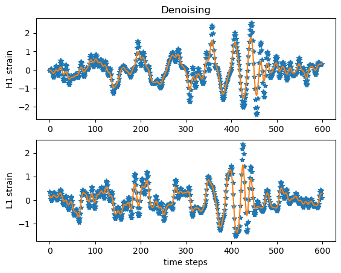

# AutoregressiveSignatures
How to model low signal-to-noise time series with path signatures.

Data\n
Black hole merger from LIGO (https://gwosc.org/eventapi/html/GWTC-1-confident/GW150914/v3/)

Method\n
An iterative algorithm to model and denoise a time series simultaneously, see "Autoregressive models for biomedical signal processing" (https://ieeexplore.ieee.org/document/10340714)

Basis functions\n
Path signatures python implementation, see https://esig.readthedocs.io/en/latest/

Details\n
This is an implementation of Algorithm 2 of my paper that runs through 3 steps until convergence:
1) Feature extraction: delay embeddings of the time series are used to extract path signatures
2) Model estimation: a linear autoregressive model is fitted by a regularised least squares of path signatures against the time series
3) Denoising and state estimation: state reconstruction given the model parameters from step 2, see for details https://arxiv.org/pdf/2104.05775.pdf

The ouput for some arbitrary parameter choices:\n

